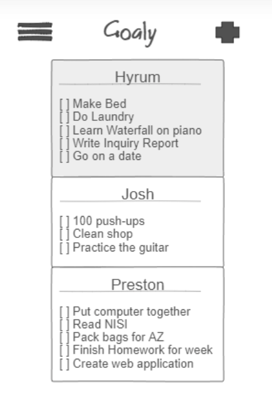

# Goaly
___
## Elevator Pitch
*Everyone sets goals, but how often do we actually achieve those goals that we set. No matter how well intentioned we are, or what goal framework we are using, the rubber never seems to meet the road. Goaly is a webservice that can change that. By taking advantage of accountability, Goaly allows your friends to see your goals and help motivate you to achieve them. Goaly, like most goal setting applications, allows you to see your own goals in a neat and organized way, helping you to keep track of what is most important. The power of Goaly comes in being able to add friends to your main dashboard, and track their goals. You can even help motivate them by sending them message when a goal has been on the dashboard for a while*

## Description
The general layout of Goaly will be very minimalist, only displaying what is important. Goals that you have set will be at the top, with check boxes you can check when you've accomplished a goal. Through the add button at the top, you can search for other users on the website, and add them as friends. Each individual user will have a special key (like a password), so you will only be able to add people if you have their key (for privacy reasons). Once a friend is added, their card will be added to your dashboard underneath your own goals so that you are able to see what your friends are working towards. There will be a feature that allows your friends to interact with your goals, maybe highlight one of your goals, so that the user knows that other people are actually keeping track of what they are doing. Other features will include an inspirational quote as the last card on the dashboard. You will also be able to set certain goals as private if you don't want your friends to be able to see them.

- **HTML** - Basic structural and organizational elements
- **CSS** - Styling and animating. This is what I will use to format all of the user cards, make it look clean and simple
- **JavaScript** - Interactivity. When you click the add friend button, it will allow you to search other users on the website. Same thing for the more button, it will allow you to edit your profile and information.
- **Web service** - Remote functions that your application calls on your, or someone else's, web server. I will call on my own webservice which is running the goal app. I will also call on a service that can give me an inspirational quote. This inspirational quote will change everyday.
- **Authentication** - Creating accounts and logging in. Each user will need a unique account so that they can track their goals over successive app launches and closes.
- **Database persistence** - Storing user data in a database. This is needed so that user goals last more than one login session, and are semi permanent. This will also allow other users to access the goals because they won't be stored locally on individual user's device.
- **WebSocket** - Support for pushing data from the server. This will be in charge of the social aspect. It is what will allow the user to look up other people, and request access to their goals, and eventually pull their goals.
- **Web framework** - Using React to add components and request routing. Not sure what this does yet, but looks like I am going to use it