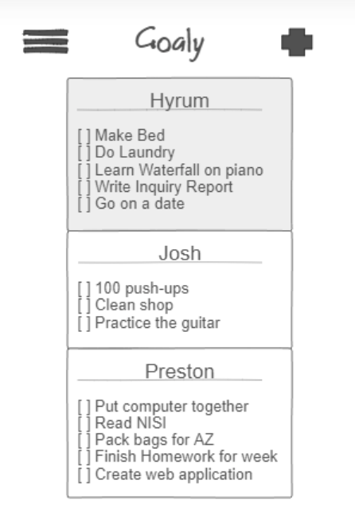

# Goaly
___
## Elevator Pitch
*Everyone sets goals, but how often do we actually achieve those goals that we set. No matter how well intentioned we are, or what goal framework we are using, the rubber never seems to meet the road. Goaly is a webservice that can change that. By taking advantage of accountability, Goaly allows your friends to see your goals and help motivate you to achieve them. Goaly, like most goal setting applications, allows you to see your own goals in a neat and organized way, helping you to keep track of what is most important. The power of Goaly comes in being able to add friends to your main dashboard, and track their goals. You can even help motivate them by sending them message when a goal has been on the dashboard for a while*

## Description
The general layout of Goaly will be very minimalist, only displaying what is important. Goals that you have set will be at the top, with check boxes you can check when you've accomplished a goal. Through the add button at the top, you can search for other users on the website, and add them as friends. Each individual user will have a special key (like a password), so you will only be able to add people if you have their key (for privacy reasons). Once a friend is added, their card will be added to your dashboard underneath your own goals so that you are able to see what your friends are working towards. There will be a feature that allows your friends to interact with your goals, maybe highlight one of your goals, so that the user knows that other people are actually keeping track of what they are doing. Other features will include an inspirational quote as the last card on the dashboard. You will also be able to set certain goals as private if you don't want your friends to be able to see them.

- **HTML** - Basic structural and organizational elements
- **CSS** - Styling and animating. This is what I will use to format all of the user cards, make it look clean and simple
- **JavaScript** - Interactivity. When you click the add friend button, it will allow you to search other users on the website. Same thing for the more button, it will allow you to edit your profile and information.
- **Web service** - Remote functions that your application calls on your, or someone else's, web server. I will call on my own webservice which is running the goal app. I will also call on a service that can give me an inspirational quote. This inspirational quote will change everyday.
- **Authentication** - Creating accounts and logging in. Each user will need a unique account so that they can track their goals over successive app launches and closes.
- **Database persistence** - Storing user data in a database. This is needed so that user goals last more than one login session, and are semi permanent. This will also allow other users to access the goals because they won't be stored locally on individual user's device.
- **WebSocket** - Support for pushing data from the server. This will be in charge of the social aspect. It is what will allow the user to look up other people, and request access to their goals, and eventually pull their goals.
- **Web framework** - Using React to add components and request routing. Not sure what this does yet, but looks like I am going to use it

# HTML Startup
___
## HTML pages for each component of your application
- I have a page for login, the main goal page, and a popup page for adding friends

## Proper use of HTML tags including BODY, NAV, MAIN, HEADER, FOOTER
- Yup, did this.

## Links between pages as necessary
 - My login page automatically links to the main page upon clicking submit, and you can navigate between my pages using the navigation bar and buttons throughout the app.

## Application textual content
Well, I did my best to write everything out.

## Placeholder for 3rd party service calls
There will be an inspirational quote that changes everyday at the bottom of the goals page, this will be pulled from 3rd party.

## Application images
My app is a pretty simplistic design, no images that I know of yet, so I added a few simple ones for fun, a + image that I turned into a button as well as I added an icon to my pages.

## Login placeholder, including user name display
I have a login page, and the usuername will be displayed on the user's goal card.

## Database data placeholder showing content stored in the database
The goals that are on each goal card will be stored in the database.

## bWebSocket data placeholder showing where realtime communication will go
The goals on your friend's goal cards will update live, so the moment your friend completes a goal or adds a new one, you will be able to see it.

# CSS Startup
**The style I am going for here is a phone application**

## Name and link to Github
Displayed underneath the login window in index.html

## Header, footer, and main content body
index.html and main.html are my two main html files

## Navigation elements
You can go back and forth between the login page and the main page, everything else will be done in the main page using java script, I have buttons that are ready to add this functionality for add goal and add friend. I made an awesome hamburger menu that I could add more elements too should I find the need such as a settings page.

## Responsive to window resizing
Looks good on everything.

## Application elements
my epic cards have transparency and blur for an asthetically pleasing experience, drawing you into the mountain range. The hamburger menu has a sick transition, and is intuitive to use. I made cool looking check circles too.

## Application text content
I have text that represents just about everything that I need to represent. changed font to a google one

## Application images
Added a few epic background images
___

# JavaScript Startup
## Have JavaScript that takes user input and adds it to the mocked database data.
I have a map named dictionary that acts as my database. Anytime the user makes a new goal, deletes a goal, adds a friend, it is updated in the database

## Have JavaScript that reads the login input and displays the user name.
The username is stored in localStorage, and displayed on the users goal card.

## Have JavaScript that mocks your database data and injects it into the DOM.
Whenever I populate the user's goals or the friend goal cards, I pull it from the database.

# Use the localstorage API to keep data between pages and browser sessions.
Yup, still doing this using two variables, username and dictionary.

## Have JavaScript that mocks out the realtime data you expect to get from the server using WebSocket and inject it into the DOM.
Friends goals are updated as a friend updates their goals. To test this functionality, try adding a few users by logging in and logging out, giving each of those users a few goals. Websocket will call display friend Cards to accomplish this.

# Service Startup
## Create an HTTP service using Node.js and Express
I made 5 services located in index.js

## Frontend served up using Express static middleware
My frontend calls an add user, get user, list user, and update user service.

## Your frontend calls third party service endpoints
I call a quote service to populate my quote card on the main page.

## Your backend provides service endpoints
Yup, it does that.

## Your frontend calls your service endpoints
Yup, we do that too

# Login Startup
## Supports new user registration
Yup, a new user can type in a username and password, and then hit register, and then it works

## Supports existing user authentication
Yup, a preregistered user can type in username and password, and then hit login and it works!

## Stores application data in MongoDB
Yup, I do this too

## Stores and retrieves credentials in MongoDB
This part actually works great! i do this too

## Restricts application functionality based upon authentication
Users can only see their goals and other user's goals when they are logged in

# Startup Websocket
## Backend listens for WebSocket connection
Does this through peerProxy

## Frontend makes WebSocket connection
login.js makes a connection when and is called at the same time as populate person in the main.html

## Data sent over WebSocket connection
A message is sent over websocket telling the page to refresh the friend goal cards

## WebSocket data displayed in the application interface
Whenever the friend of a user updates their goals, they are automatically updated on their page.